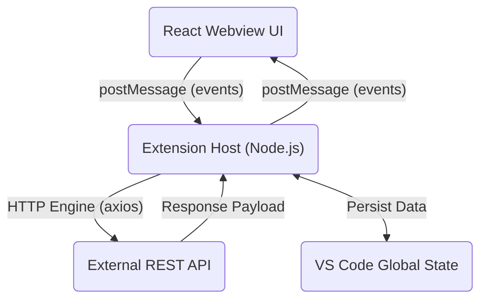
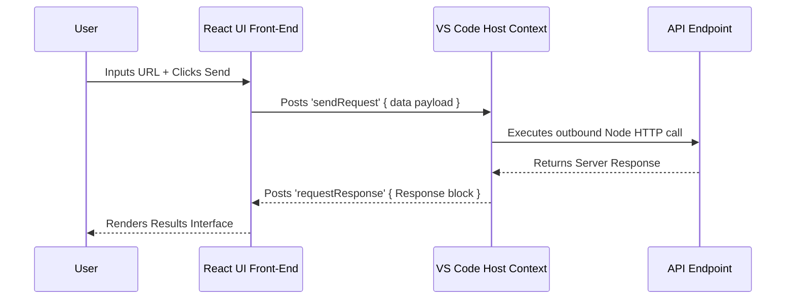

# Qurl - REST API Client for VS Code

Qurl is an advanced, integrated REST API client extension for Visual Studio Code. Designed to streamline your development workflow, Qurl allows you to build, manage, test, and save HTTP requests dynamically inside your editor without fighting against browser CORS restrictions limiters. 

## Features
- **Comprehensive HTTP Methods:** Support for GET, POST, PUT, DELETE, and PATCH methods.
- **Hierarchical Collections:** Organize endpoints seamlessly into dynamic, collapsible folder structures.
- **Persistent Global State:** Your folders and request layouts are saved using VS Code's global memory. Changes made in one window or project will be instantly available in any other VS Code workspace on your machine.
- **Native Context Node Requests:** Because HTTP requests are handled inside the VS Code host context via Node's `axios`, developers do not need to worry about origin constraints (CORS) typical to browser-based utilities.

## Installation

### From Source

1. Clone or download this repository locally.
2. Open your VS Code editor to the directory of the downloaded project.

### Build Instructions

You will need **Node.js** and **npm** installed on your machine.
Run the following commands within the extension directory:

1. Install all dependencies for both the Extension and the Webview:
   ```bash
   npm install
   cd webview-ui && npm install
   cd ..
   ```
2. Compile and build the extension:
   ```bash
   npm run build:webview
   npm run compile
   ```

To generate a generic distributable `.vsix` package:
1. Ensure `vsce` is installed globally: `npm install -g @vscode/vsce`
2. Run `vsce package` in the root directory.
3. Install the generated `.vsix` file inside VS Code (`Extensions > ... > Install from VSIX`).

## Usage

1. Open the VS Code **Command Palette** (`Ctrl+Shift+P` on Windows/Linux, `Cmd+Shift+P` on Mac).
2. Type and run the command **`Qurl: Open API Client`**.
3. In the new Qurl Panel:
   - **Send a Request:** Target a URL (e.g., `https://jsonplaceholder.typicode.com/posts/1`), select a method (GET/POST), and tap **Send**.
   - **Configure Headers/Body:** Use the tabs to inject any standard Authorization/General headers or JSON payloads necessary for the API.
   - **Organize Collections:** Use the `📁` icon in the left Sidebar to instantiate recursive Folder architectures. Use the "Save" button nearby the URL bar to deposit your endpoint configuration safely.

## Architecture Architecture Overview

The application follows a strictly defined messaging pattern between the visual interface and the isolated backend Extension Host.



### Data Flow Execution



## License
MIT License. See [LICENSE](LICENSE) for more details.
