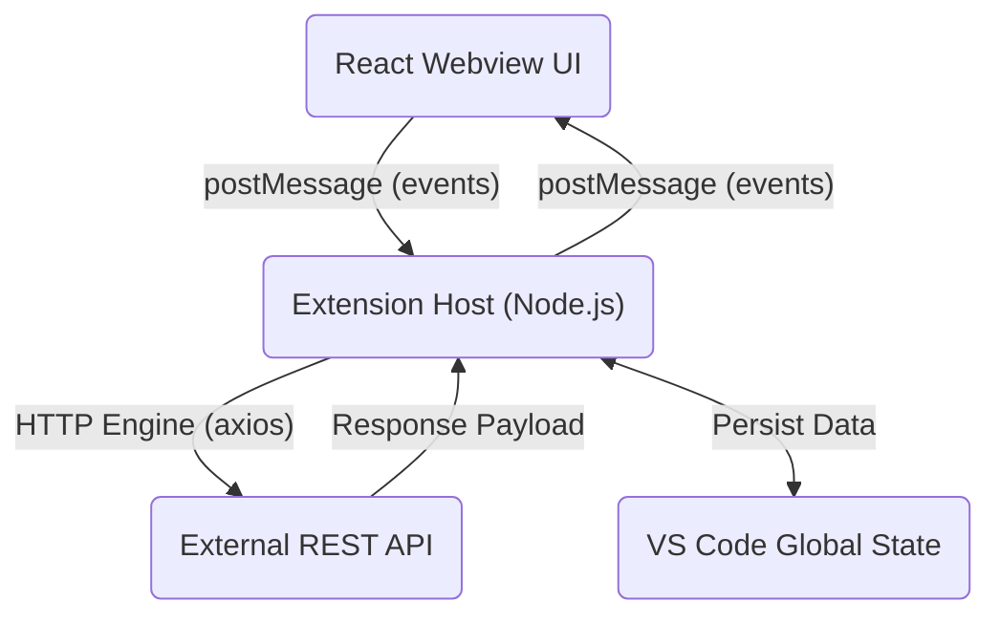
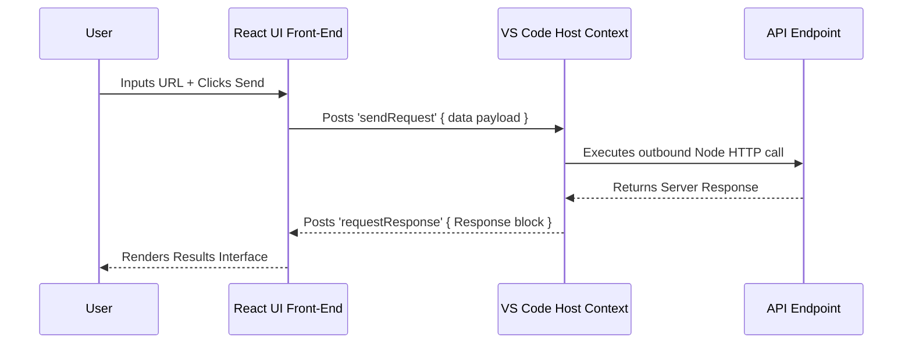

# Architecture Overview

The application follows a strictly defined messaging pattern between the visual interface and the isolated backend Extension Host.

```mermaid
graph TD;
    WebView("React Webview UI") -->|"postMessage (events)"| Extension("Extension Host (Node.js)");
    Extension -->|"HTTP Engine (axios)"| World("External REST API");
    World -->|"Response Payload"| Extension;
    Extension -->|"postMessage (events)"| WebView;
    Extension <-->|"Persist Data"| Storage("VS Code Global State");
```

### Data Flow Execution

```mermaid
sequenceDiagram
    participant User
    participant Webview as React UI Front-End
    participant Extension as VS Code Host Context
    participant Network as API Endpoint
    
    User->>Webview: Inputs URL + Clicks Send
    Webview->>Extension: Posts 'sendRequest' { data payload }
    Extension->>Network: Executes outbound Node HTTP call
    Network-->>Extension: Returns Server Response
    Extension-->>Webview: Posts 'requestResponse' { Response block }
    Webview-->>User: Renders Results Interface
```
